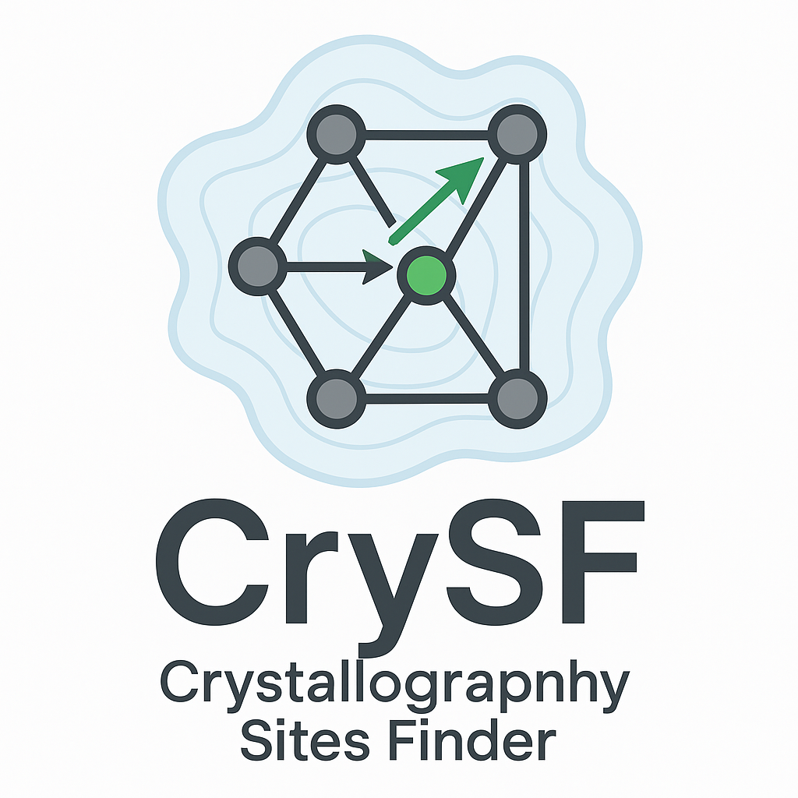

`CrySF` (Crystallography Sites Finder) is a specialized Python software designed to analize molecular dynamics trajectories of crystalline solid-state ionic conductors. This tool not only identifies and characterizes the crystallographic sites occupied by diffusive atoms but also examines the transitions of these atoms between sites. Such analyses provide crucial insights for researchers studying advanced materials. 

The software operates through two distinct commands. The first command, DensityMap, processes the atomic trajectories into data that the second command, CrySF, can further analyze. For a comprehensive understanding of the theoretical foundations and functionalities of `CrySF`, readers are encouraged to consult the examples and manuscript titled [Unsupervised density-based method for analyzing ion mobility in crystalline solid-state electrolytes](https://www.nature.com/articles/s41524-025-01861-6#article-info) authored by Henry A. Cortés, Mauricio R. Bonilla, and Elena Akhmatskaya. This document includes numerous examples that demonstrate the practical applications of the software.

`CrySF` can be requiers minimal prior knowledge about the material's and soports different trajectory formats (XTC, TRR, LAMMPSDUMP and XDATCAR).

## Installation Requirements:

- Python (>=3.8) https://www.python.org/downloads/
- MDanalysis https://www.mdanalysis.org/
- scikit-learn https://scikit-learn.org/stable/
- Matplotlib https://matplotlib.org/
- SciPy https://scipy.org/
- Seaborn https://seaborn.pydata.org/ 

## Installation

To install and use the `CrySF` software in a Linux-like system. The user can obtain the code by cloning the following repository:

```
git clone https://gitlab.bcamath.org/hacortes/crysf
```

The command will create the crysf/ folder with the source files. For the `CrySF` package installation, execute the following command (in a UNIX-like terminal):

```
cd crysf/
pip install .
```

## Running CrySF

Copy the files densitymap.py and crysf.py scripts into the same folder as your simulation data.

1. Execute DensityMap to create the density map:

```
python densitymap.py -to "topology file" -tr "trajectory file" -f "format" -ts "time interval [ps]" -a "atom name or type" -v "voxel size [Å]"
```

2. After generating the density map, run crysf.py with the command:

```
python crysf.py  -nts "time interval between frames [ps]"
```
Details of the settings to be used in the DensityMap and CrySF commands can be found in the examples folder.


## Reference

If you use CrySF, please cite [this paper](https://www.nature.com/articles/s41524-025-01861-6#article-info):

```bib
@article{cortes_2025_crysf,
    title={Unsupervised density-based method for analyzing ion mobility in crystalline solid-state electrolytes},
    DOI={10.1038/s41524-025-01861-6},
    journal={npj computational materials},
    author={Cort\'es, Henry A. and Rinc\'on Bonilla, Mauricio and Akhmatskaya, Elena},
    volume = {11}
    year={2025},
    pages={1–15}
}
```

## Authors and acknowledgment
- Dr. Henry Andres Cortes, BCAM - Basque Center for Applied Mathematics, Spain
- Dr. Mauricio Rincon Bonilla, BCAM - Basque Center for Applied Mathematics, Spain
- Prof. Elena Akhmatskaya, BCAM - Basque Center for Applied Mathematics, Spain
